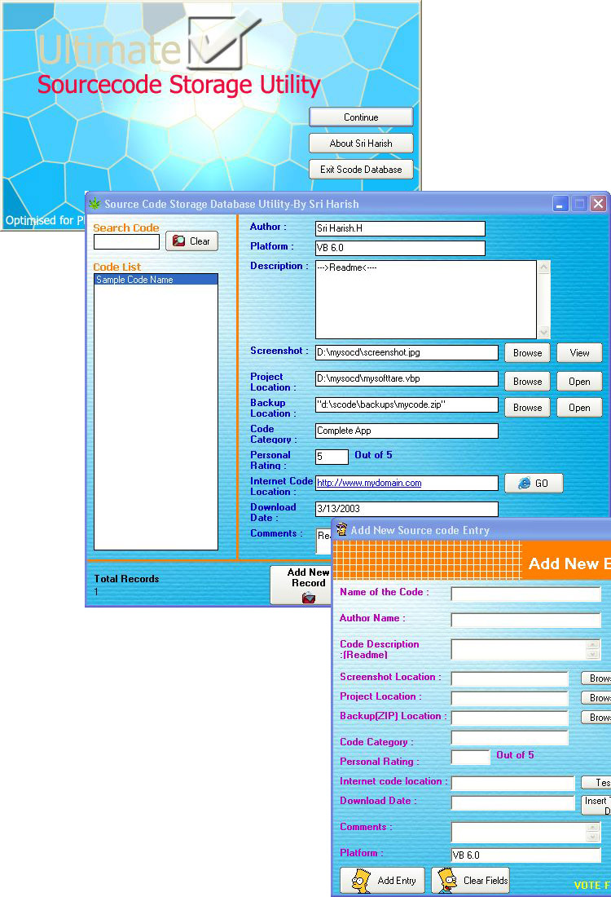

## Ultimate Source Code Storage Database Xp

### Description

READ THIS° : Do you have so many Source Codes and don't know how to arrange them?. Well, here is the answer to all your problems. The Ultimate Source Code Storage Database utility has come atlast. The program contains whole new features where users can EASILY STORE: CODE NAMES, AUTHOR NAMES, DESRIPTION( Read Me's), PLATFORM, PROJECT LOCATIONS, ZIP FILE LOCATIONS (Backup Locations), RATINGS, DOWNLOAD LOCATIONS, DOWNLOAD DATES, CATEGORIES,COMMENTS and whole lot more. The Code contains BUILT IN advanced SEARCH PROGRAM where users can easily search their code in the Database. Have a look at SCREENSHOT. Users don't have to worry about Zip files that come in unique names, just mention the Zip Location of the code in this program and program will do the rest- by storing the Zip file location in the database. You can EASILY OPEN- Projects, Zip Files, and Screenshots. In the same way you can store author name, readme's, Voting locations, download dates, comments, personal ratings and lotZ more. This program uses a eye catching Visual Styles with Windows Xp like interface. If you want to Print- then this programs ADVANCED PRINT facilty is just for you. This code is optimised for Planet source code users but you can twist it the way you want. This code also contains Easy to Use ADD ENTRY FORM where users can easily add their code and their details to the DATABASE. You will never know How this utility may come in handy for you, until you download the Code. Perviously i was using this utility for my personal use and this time its for you with a bunch of New ADVANCED FEATURES. Please DON'T FORGET TO VOTE FOR ME. Add this code to the Database first.°!!!°
 
### More Info
 

             |
---                |---
**Submitted On**   |2003-03-16 09:37:22
**By**             |[Sriharish\.H](https://github.com/Planet-Source-Code/PSCIndex/blob/master/ByAuthor/sriharish-h.md)
**Level**          |Beginner
**User Rating**    |4.7 (42 globes from 9 users)
**Compatibility**  |VB 5\.0, VB 6\.0
**Category**       |[Databases/ Data Access/ DAO/ ADO](https://github.com/Planet-Source-Code/PSCIndex/blob/master/ByCategory/databases-data-access-dao-ado__1-6.md)
**World**          |[Visual Basic](https://github.com/Planet-Source-Code/PSCIndex/blob/master/ByWorld/visual-basic.md)
**Archive File**   |[Ultimate\_S1566943312003\.zip](https://github.com/Planet-Source-Code/sriharish-h-ultimate-source-code-storage-database-xp__1-44384/archive/master.zip)

